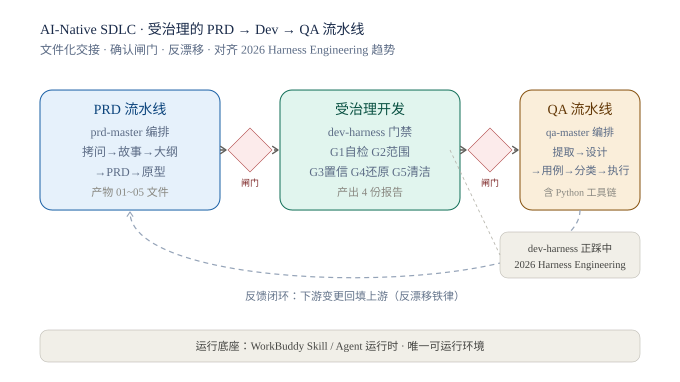

# AI-Native SDLC · 受治理的 PRD → Dev → QA 流水线技能包

> 一套面向 AI 编程时代的「产品 → 交付」治理方法论，附带可在 WorkBuddy 中运行的参考实现。
> 由**产品经理视角**设计：让 AI Agent 在需求、开发、测试三段都做到「可控、可观、可回退」。



---

## 为什么做这个

AI 编程工具越来越强，但有三个通病：

1. **一次性写码就跑偏**——需求里有 10 个隐含假设，Agent 替你拍了 9 个，第 4 个在生产环境才爆。
2. **上下文一多就漂移**——对话越长，越早期的决策越容易被忘，前后产物对不上。
3. **无人验收就当完成**——Agent 说"写完了"，其实没跑测试、改了不相关的代码。

我的解法不是写更长的 prompt，而是把"产品 → 开发 → 测试"拆成**三段受治理的流水线**，每段用
**多 Agent 编排 + 确认闸门 + 文件化交接**串起来。这正好对应 2026 年成名的
[Harness Engineering（受治理 AI 开发）](https://www.augmentcode.com/guides/harness-engineering-ai-coding-agents)
学科——我是在 2026 年独立搭建的，与这套方法论同期、思路一致。

---

## 它包含什么

### 1. PRD 流水线（`prd-master` + 5 步子技能）
把"一个想法"变成"一份可执行的 PRD + 可点击原型"。编排器只做调度，**不生产内容**；
每步产物落盘为文件（01-brief → 02-stories → 03-outline → 04-prd → 05-prototype），
下游步骤只看文件、不读聊天历史，从根上杜绝上下文漂移。每步有**确认闸门**，没确认不进下一步。

### 2. 受治理开发（`dev-harness` + `harness/` 治理母本）
一套架在"需求"与"开发 AI"之间的 5 道门禁：
`G1 自检闭环` / `G2 范围自检` / `G3 置信度上报` / `G4 一键还原` / `G5 代码清洁`。
看不懂的需求不写、超范围的不提交、炸了能秒回退。治理规则以**人读 + AI 读**双视图存在。

### 3. QA 流水线（`qa-master` + 5 步子技能，含 Python 工具链）
把"测什么"变成"可执行的用例 + 人/AI 分工表 + 执行报告"。不只是 prompt——
`scripts/` 下是**真实干活的 Python 工具**：`gate_check`（门禁校验）、`trace_audit`（过程追溯）、
`merge`（结果合并）、`generate_excel` / `format_excel`（用例表生成）。

---

## 核心设计原则

- **文件化交接（anti-drift）**：步骤之间唯一的信息接口是产物文件，聊天噪音到此为止。
- **确认闸门（human-in-the-loop）**：关键节点必须人确认，Agent 不私自推进。
- **工具链真实干活**：能写成代码的校验/生成，就不靠嘴说"请遵守规则"。
- **失败时回填上游**：下游变了，自动回头同步上游文档，保证产物始终一致。

---

## 怎么用

### 前置
1. 安装 [WorkBuddy](https://www.workbuddy.cn)。
2. 把本仓库 `skills/` 下的 13 个 skill 复制到你的 WorkBuddy skills 目录。
3. 把 `harness/` 复制到 `~/.workbuddy/harness/`（或某个项目的 `.workbuddy/harness/`）。

### 跑起来
- 对 AI 说"帮我做个 PRD" → 走 `prd-master`
- 说"用 harness 开发" → 走 `dev-harness`
- 说"跑 QA" → 走 `qa-master`

---

## 这是方法论，也是参考实现

即使你不装 WorkBuddy，本仓库的 **README + 架构图 + 各 skill 的产物规范**也能让你完整看懂
"如何治理 AI 开发"。这套方法论可平移到 Cursor / Claude Code / Codex 等任何 Agent 运行时——
把 `guardrails/` 和"确认闸门"搬过去即可。

> 注：本仓库的 skill 使用 WorkBuddy 的 Skill / Agent / 文件工具原语，是唯一可"直接运行"的环境。
> 其价值更在**设计思路**本身。

---

## 给面试官的一句话

> 我独立设计了一套 AI 原生产品交付治理框架，与 2026 年成名的 Harness Engineering 思路一致，
> 涵盖 PRD 编排、开发门禁、QA 工具链三段闭环——核心解决的是"AI Agent 上下文漂移"和"无人验收即完成"两个行业通病。

---

## 目录结构

```
ai-sdlc-skills/
├── README.md
├── LICENSE                 # MIT
├── .gitignore
├── .gitattributes
├── assets/
│   └── architecture.svg    # 架构图（本文档配图）
├── skills/
│   ├── prd-master/         # PRD 编排器
│   ├── prd-step1-grill/    # ① 需求拷问
│   ├── prd-step2-stories/  # ② 用户故事
│   ├── prd-step3-outline/  # ③ 设计大纲
│   ├── prd-step4-prd/      # ④ PRD
│   ├── prd-step5-prototype/# ⑤ 交互原型
│   ├── qa-master/          # QA 编排器 + Python 工具链
│   ├── qa-step1-extract/   # ① 需求提取
│   ├── qa-step2-design/    # ② 测试设计
│   ├── qa-step3-cases/     # ③ 用例编写
│   ├── qa-step4-classify/  # ④ 用例分类（人 / AI）
│   ├── qa-step5-exec/      # ⑤ 用例执行
│   └── dev-harness/        # 受治理开发门禁
└── harness/                # dev-harness 依赖的治理母本
    ├── guardrails/         # G1~G5 五道门禁
    ├── module-map.yaml/.md # 功能 → 目录 映射
    ├── request.schema      # 产物报告字段规范
    ├── requirement.example.md
    └── snapshots/          # 版本快照
```

## License

[MIT](LICENSE) © 2026 susubing123
